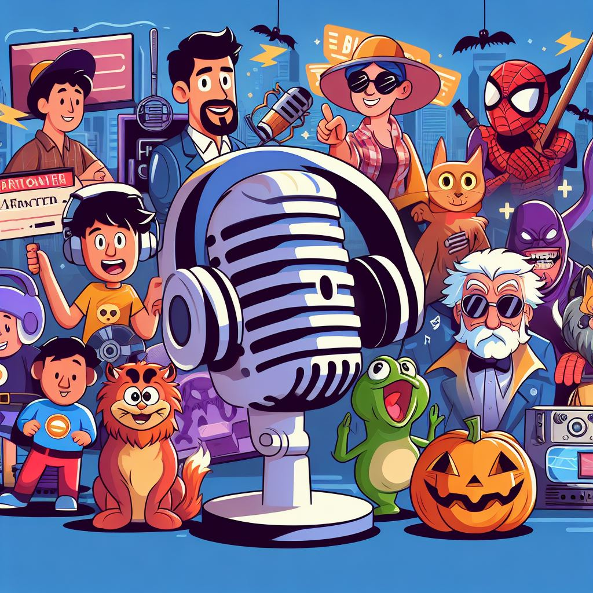

# try-podcast-on
Projeto de Criação de um Podcast do Bootcamp Fundamentos de Inteligência Artificial para Devs realizado pela Dio junto com o Santander Open Academy.

    Preview do Podcast "Esboços Espertos: Onde a Imaginação Ganha Forma e Fama"

    <audio src="output/podcast_editado.MP3" controls title="Podcast editado"></audio>

## 💻 Tecnologias utilizadas no projeto

- [Microsoft Copilot](https://copilot.microsoft.com/) 
- [ElevenLabs](https://elevenlabs.io/)

## ✨ Como foi feito ?

- Roteiro gerado via Microsoft Copilot
- Audio gerado pela ElevenLabs
- Microsoft Copilot para gerar capas
