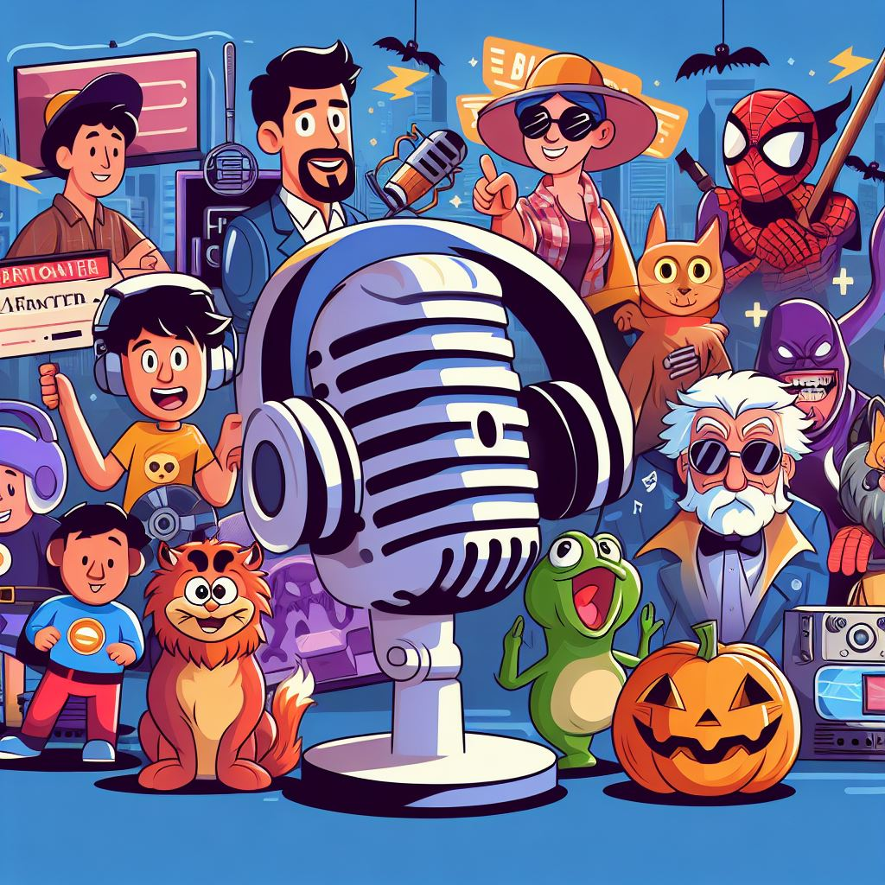

## PROMPT 01: CRIAR O NOME DO PODCAST
Você é um roteirista de podcast, e vamos criar um podcast de criação de cartoons originais e eu gostaria de uma ajuda sua para criar 5 sugestões de nomes criativos para um podcast de criação de cartoons para cartunistas, e que tenha algum trocadilho cômico no nome

O podcast vai falar sobre cartoons famosos e a criação de personagens originais e o que está acontecendo no mercado editorial e no cinema e na televisão e nos canais de streming via internet

{REGRAS}

- O nome deve ser enxuto, um nome e um subtítulo
- O nome tenha algum trocadilho comico com classicos dos gibis
- O nome deve conter alguma palavra forte que remeta a cartoons com originalidade

{REGRAS NEGATIVAS}

- Não quero que o título contenha palavras em inglês
- Não quero que utilize nenhuma das palavras nessa lista: dc,marvel
- Não utilize a palavra cartoon no nome nem qualquer variação dela
### RETORNO
Aqui estão cinco sugestões de nomes para o seu podcast que seguem as regras estabelecidas:

1. **Rabiscos Risonhos**: Desenhando Sorrisos com Arte e Astúcia
2. **Traços Travessos**: A Arte de Criar com Humor e História
3. **Esboços Espertos**: Onde a Imaginação Ganha Forma e Fama
4. **Linhas Lúdicas**: Narrativas Visuais e o Mundo dos Quadrinhos
5. **Figuras Farsantes**: Entre Risos e Rascunhos, a Arte de Enganar o Olhar

Espero que essas sugestões inspirem a criação de um podcast divertido e informativo sobre o mundo dos quadrinhos e animações!

## PROMPT 02: EPISÓDIO DO PODCAST
Você é um roteirista de podcast, e vamos criar um  roteiro de um podcast de criação de cartoons originais cujo o nome é "Esboços Espertos: Onde a Imaginação Ganha Forma e Fama" e tem foco em histórias em quadrinhos,  com o público alvo de cartunistas.

o formato do roteiro deve ser
[INTRODUÇÃO]
[CURIOSIDADE 1]
[CURIOSIDADE 2]
[FINALIZAÇÃO]

{REGRAS}

- no bloco [INTRODUÇÃO] substitua por uma introdução iguais as introduções dos vídeos do canal 'ei nerd', como se fossem escritos pelo Peter Jordan
- no bloco [CURIOSIDADE 1] substitua por uma curiosidade de filme de super-herói
- no bloco [CURIOSIDADE 2] crie um novo personagem de super-herói
- no bloco [FINALIZAÇÃO] substitua por uma despedida cool com o final 'Nós vamos fazer muita criação!'
- use termos de fácil explicação
- O podcast vai ser apresentado somente por uma pessoa, chamada El-Vintão
- O podcast deve ser curto

{REGRAS NEGATIVAS}

- Não use muitos termos técnicos
- Não ultrapasse 5 minutos de duração
### RETORNO
[INTRODUÇÃO]
E aí, galera, beleza? Aqui é o El-Vintão, diretamente do estúdio de Esboços Espertos, o seu podcast de histórias em quadrinhos onde a imaginação não tem limites! Hoje, vamos mergulhar no universo fascinante dos super-heróis e descobrir curiosidades incríveis que vão fazer sua mente explodir! Preparados? Então, ajustem seus cintos de utilidades, porque a aventura começa agora!

[CURIOSIDADE 1]
Você sabia que o filme 'Homem de Ferro', lançado em 2008, foi o grande estopim para o Universo Cinematográfico da Marvel como conhecemos hoje? Isso mesmo! Foi a aposta certeira em um personagem que não estava no topo da popularidade, mas que conquistou fãs ao redor do mundo e abriu caminho para uma das franquias mais bem-sucedidas do cinema!

[CURIOSIDADE 2]
Agora, deixem-me apresentar um novo herói que vai balançar as estruturas do nosso imaginário: o Guardião do Grafite! Com poderes que lhe permitem transformar qualquer desenho em realidade, ele é um artista de rua durante o dia e um defensor da justiça à noite, usando sua criatividade para combater o crime e inspirar mudanças!

[FINALIZAÇÃO]
E por hoje é só, pessoal! Espero que tenham curtido essa viagem pelo mundo dos super-heróis e das histórias que nos fazem sonhar acordados. Lembrem-se: a criatividade é o nosso superpoder mais valioso. Então, mantenham seus lápis afiados e suas ideias fluindo, porque juntos, nós vamos fazer muita criação! Até a próxima, e um abraço do El-Vintão!
### PROMPT TEXT TO SPEECH

E aí, galera, beleza? Aqui é o El-Vintão, diretamente do estúdio de Esboços Espertos, o seu podcast de histórias em quadrinhos onde a imaginação não tem limites! Hoje, vamos mergulhar no universo fascinante dos super-heróis e descobrir curiosidades incríveis que vão fazer sua mente explodir! Preparados? Então, ajustem seus cintos de utilidades, porque a aventura começa agora!

Você sabia que o filme 'Homem de Ferro', lançado em 2008, foi o grande estopim para o Universo Cinematográfico da Marvel como conhecemos hoje? Isso mesmo! Foi a aposta certeira em um personagem que não estava no topo da popularidade, mas que conquistou fãs ao redor do mundo e abriu caminho para uma das franquias mais bem-sucedidas do cinema!

Agora, deixem-me apresentar um novo herói que vai balançar as estruturas do nosso imaginário: o Guardião do Grafite! Com poderes que lhe permitem transformar qualquer desenho em realidade, ele é um artista de rua durante o dia e um defensor da justiça à noite, usando sua criatividade para combater o crime e inspirar mudanças!

E por hoje é só, pessoal! Espero que tenham curtido essa viagem pelo mundo dos super-heróis e das histórias que nos fazem sonhar acordados. Lembrem-se: a criatividade é o nosso superpoder mais valioso. Então, mantenham seus lápis afiados e suas ideias fluindo, porque juntos, nós vamos fazer muita criação! Até a próxima, e um abraço do El-Vintão!

## PROMPT 03: GERAÇÃO DA IMAGEM DA CAPA
Crie uma capa para um podcast que vai falar sobre cartoons famosos e a criação de personagens originais e o que está acontecendo no mercado editorial e no cinema e na televisão e nos canais de streming via internet
### RETORNO
#### Pesquisa do Designer do Microsoft Copilot feito pelo browser
Capa de podcast sobre cartoons famosos, criação de personagens originais, mercado editorial, cinema, televisão e canais de streaming
#### Imagens
Conferir a pasta capas
#### Imagem selecionada
